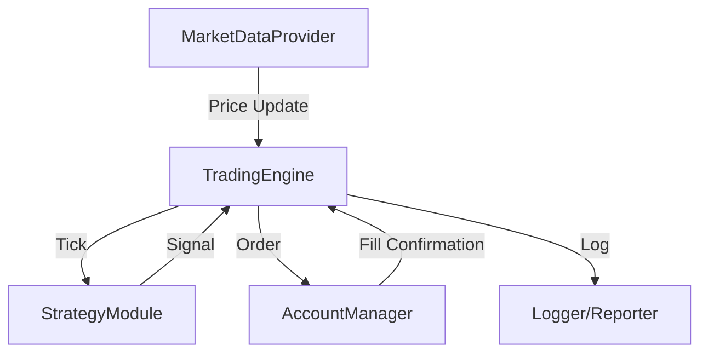

# System Design Document

## 1. Architecture Overview
The system follows a modular event-driven architecture (simplified for POC).

## 2. Core Modules

### 2.1 MarketDataProvider
*   **Responsibility:** Fetch real-time exchange rates.
*   **Interface:** `get_current_price(symbol: str) -> float`
*   **Implementation:** `YFinanceProvider` (using `yfinance` library) or `MockProvider` (for testing).

### 2.2 AccountManager
*   **Responsibility:** Manage cash balances (USD, CNY) and execute virtual trades.
*   **Attributes:**
    *   `balance_cny`: float
    *   `balance_usd`: float
    *   `transaction_history`: List[Transaction]
*   **Methods:**
    *   `execute_trade(side: str, quantity_usd: float, price: float)`
    *   `get_total_equity_cny(current_price: float) -> float`

### 2.3 StrategyModule
*   **Responsibility:** Analyze price history and generate signals.
*   **Logic:** SMA Crossover.
*   **Attributes:**
    *   `prices`: List[float] (History window)
    *   `short_window`: int
    *   `long_window`: int
*   **Methods:**
    *   `on_tick(price: float) -> Signal (BUY/SELL/HOLD)`

### 2.4 TradingEngine
*   **Responsibility:** Main loop, orchestrating data fetch, strategy execution, and account updates.
*   **Methods:**
    *   `run()`: Infinite loop (or N iterations) fetching data and processing.

## 3. Data Model (In-Memory/Log)
*   **Transaction:**
    *   `timestamp`: datetime
    *   `pair`: "USD/CNY"
    *   `action`: "BUY" | "SELL"
    *   `price`: float
    *   `quantity`: float
    *   `fee`: float (optional)

## 4. Technology Stack
*   **Language:** Python 3.9+
*   **Dependencies:**
    *   `yfinance`: Market Data
    *   `pandas`: Data manipulation (SMA calculation)
    *   `pytest`: Testing framework
    *   `pytest-cov`: Coverage reporting
